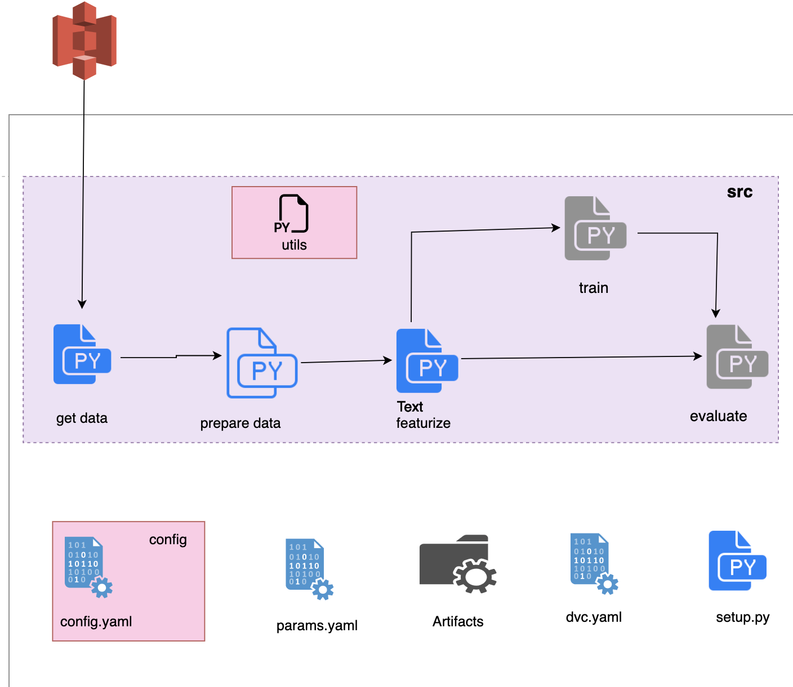

# DVC NLP Stackoverflow Tag Predictor
- we will build simple **binary classfication to classify Stackoverflow question into Python tags or non Python Tags.**
- This project is simple **implementation of End To End ML Pipeline using DVC Tool.**
- Using **GitHub Actions for tracking ML Workflow.**
- Used DVC to monitor end to end pipeline results.

# Project Workflow

# dvc-project-template
DVC project template


```bash
conda create --prefix ./env python=3.7 -y
```

```bash
conda activate ./env
```
OR
```bash
source activate ./env
```

### STEP 04- install the requirements
```bash
pip install -r requirements.txt
```

### STEP 05- initialize the dvc project
```bash
dvc init
```

### STEP 06- reproduce training
```bash
dvc repro
```


